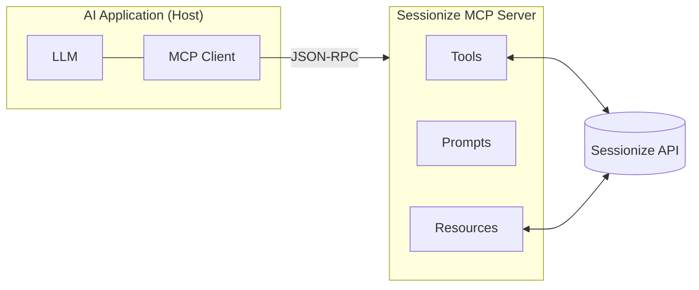

# Sessionize MCP Server

[](https://www.npmjs.com/package/mcp-sessionize)
[](LICENSE)

MCP server for accessing [Sessionize](https://sessionize.com) event data — speakers, sessions, and schedules — from any MCP-compatible AI assistant (Claude Desktop, Claude Code, Cursor, Windsurf, VS Code…).

Built with **Quarkus 3.33 + Java 25 + Quarkus MCP Server 1.13**, distributed as a tiny native executable (Mandrel) and via `npx mcp-sessionize`.

---

## Features

### Tools

| Tool | Description |
|------|-------------|
| `sessionize_get_speakers` | List all speakers (paginated) |
| `sessionize_find_speaker` | Search a speaker by name (paginated) |
| `sessionize_get_sessions_by_speaker` | List the sessions a speaker presents |
| `sessionize_get_sessions` | List confirmed, non-service sessions (paginated) |
| `sessionize_find_session` | Search sessions by title/description (paginated) |
| `sessionize_get_schedule` | Get the event schedule by day and time slot |

Tool names use the `sessionize_` prefix (snake_case) to avoid collisions when used alongside other MCP servers. All tools are annotated as **read-only** and **idempotent** (`@Tool.Annotations`), so MCP clients know they never mutate state. List tools accept `limit` (default 25, max 100) and `offset` arguments and return pagination metadata.

### Prompts

| Prompt | Description |
|--------|-------------|
| `event_overview` | Conference overview (speaker/session counts, topics) |
| `find_speaker_info` | Detailed info about a speaker |
| `sessions_by_topic` | Find sessions on a topic/technology |
| `conference_schedule` | Full schedule by day and time |
| `speaker_sessions` | Sessions presented by a speaker |
| `recommend_sessions` | Session recommendations based on interests |

---

## How MCP Works — Architecture & Concepts

> A short primer on *why* this server is shaped the way it is. An MCP server is **not** just an API proxy — it exposes **capabilities** to an AI model through three distinct primitives, each with its own *control model* (who decides when it runs).

### The architecture

MCP follows a **host → client → server** model. The host (the AI application) runs one client per server; each server exposes its capabilities over JSON-RPC. Servers can be local (STDIO) or remote (HTTP).



### The three primitives (and who controls them)

This is the core idea: **a tool is a function the model can call, not a database row.** Pick the primitive by *who* should drive it.

| Primitive | Control model | Purpose | Analogy | In this server |
|-----------|---------------|---------|---------|----------------|
| **Tools** | **Model-controlled** — the LLM decides when to invoke them based on the conversation | **Actions / capabilities**: do something, compute, query on demand | a function call / `POST` | `findSpeaker`, `getSchedule`… — the model *actively searches* the event |
| **Resources** | **Application-controlled** — the host decides what context to load | **Data / context**: expose readable content addressed by URI | a file / `GET` | _(candidate)_ e.g. `sessionize://{eventId}/speakers` as attachable context |
| **Prompts** | **User-controlled** — surfaced for explicit user selection (e.g. slash commands) | **Templates / workflows**: guided, reusable interactions | a saved command | `event_overview`, `recommend_sessions`… |

> **So "tools must cover functionality, not just API calls" is exactly right.** A good tool maps to a *task the model wants to accomplish* (`findSpeaker by name`, `getSessionsBySpeaker`), with a clear description, typed arguments, and behavior hints — even if under the hood it happens to call a REST API. If your tool is *"return this raw dataset as context"* with no decision involved, that's a **Resource**, not a Tool. If it's *"a canned multi-step interaction the user triggers"*, that's a **Prompt**.

### Beyond the three: richer capabilities

MCP 1.13 also supports server↔client interactions that make tools more than one-shot calls:

- **Sampling** — the server asks the *host's* LLM to generate text (agentic loops) — always with a human in the loop.
- **Elicitation** — a tool pauses to ask the user for additional input mid-execution.
- **Progress & cancellation** — long-running tools can report progress and be cancelled.
- **Roots** — the client tells the server which filesystem/URI scopes it may operate in.

This server currently uses **Tools + Prompts**; Resources, Sampling and Elicitation are natural next steps.

---

## Prerequisites

### To **use** the server (recommended path)

| Requirement | Why |
|-------------|-----|
| **Node.js 18+** (`npx`) **or** Docker | To launch the prebuilt server |
| A **Sessionize Event ID** | The event whose data you want to expose ([how to get it](#get-your-event-id)) |
| An MCP client | Claude Desktop, Claude Code, Cursor, Windsurf, VS Code… |

The `npx` and Docker distributions bundle a native binary — **no JDK required** to run.

### To **build from source**

| Requirement | Version | Notes |
|-------------|---------|-------|
| **JDK** | **25** (LTS) | Required: the project uses `maven.compiler.release=25`, JEP 511 module imports, and JVM flags introduced in JDK 23+. Java ≤21 will not build. |
| Maven | bundled | Use the included wrapper `./mvnw` (Maven 3.9.x). Do not use a global `mvn`. |
| **Mandrel / GraalVM 25** | optional | Only needed for `-Dnative` builds. `sdk install java 25-graalce` works. |
| Docker | optional | Only needed to build the container image. |

> **⚠️ `JAVA_HOME` gotcha.** `./mvnw` prefers `JAVA_HOME` over the `java` on your `PATH`. If `JAVA_HOME` points to Java ≤21 the build fails with `Unrecognized option: --sun-misc-unsafe-memory-access=allow`. Point it at a JDK 25:
> ```bash
> export JAVA_HOME="$HOME/.sdkman/candidates/java/current"   # e.g. sdkman 25-graalce
> ./mvnw verify
> ```

---

## Get Your Event ID

1. Log in to [Sessionize](https://sessionize.com).
2. Select your event → **API / Embed** → enable **API**.
3. Copy the Event ID from the URL: `https://sessionize.com/api/v2/{EVENT_ID}/view/All`.

Set it via the `SESSIONIZE_EVENT_ID` environment variable (default event) or pass `eventId` directly in any tool call.

---

## Installation

### Claude Desktop

Add to `~/Library/Application Support/Claude/claude_desktop_config.json` (macOS) or `%APPDATA%\Claude\claude_desktop_config.json` (Windows):

```json
{
  "mcpServers": {
    "sessionize": {
      "command": "npx",
      "args": ["-y", "mcp-sessionize"],
      "env": {
        "SESSIONIZE_EVENT_ID": "your-event-id"
      }
    }
  }
}
```

### Claude Code

```bash
claude mcp add sessionize -e SESSIONIZE_EVENT_ID="your-event-id" -- npx -y mcp-sessionize
```

### Cursor / Windsurf / VS Code

| Editor | Config file |
|--------|-------------|
| Cursor | `~/.cursor/mcp.json` |
| Windsurf | `~/.codeium/windsurf/mcp_config.json` |
| VS Code | `code --add-mcp '{"name":"sessionize","command":"npx","args":["-y","mcp-sessionize"],"env":{"SESSIONIZE_EVENT_ID":"your-event-id"}}'` |

### Docker

The image runs in **HTTP mode** (Streamable HTTP at `/mcp`, SSE at `/mcp/sse`):

```bash
docker run -i --rm -p 8080:8080 \
  -e SESSIONIZE_EVENT_ID=your-event-id \
  ghcr.io/jeanlopezxyz/mcp-sessionize
```

---

## Configuration

### Environment variables

| Variable | Default | Applies to | Description |
|----------|---------|-----------|-------------|
| `SESSIONIZE_EVENT_ID` | _(empty)_ | all | Default event ID when a tool call omits `eventId`. |
| `PORT` | `8080` | HTTP/SSE | Port for the HTTP transport (`%sse` profile / Docker). |
| `QUARKUS_MCP_SERVER_STDIO_ENABLED` | `true` | all | `false` to disable STDIO (the Docker image sets this). |
| `QUARKUS_HTTP_CORS_ORIGINS` | `*` | HTTP/SSE | Allowed CORS origins. **Restrict in production.** |

The Sessionize REST client uses a 10 s connect timeout and a 30 s read timeout, and forces no-cache headers.

### Transports & profiles

The server picks its transport from the active Quarkus profile (configured in `application.properties`):

| Mode | How to activate | Transport | Endpoint |
|------|-----------------|-----------|----------|
| **STDIO** (default) | run with no profile | stdio | stdin/stdout |
| **HTTP / SSE** | `%sse` profile (`-Dquarkus.profile=sse`) or the Docker image | Streamable HTTP + SSE | `/mcp`, `/mcp/sse` |
| **Dev** | `./mvnw quarkus:dev` | HTTP + live reload | `/mcp` |

> **STDIO note.** In STDIO mode Quarkus already redirects console logging to **stderr** and sets stdout to null, so logs never corrupt the JSON-RPC stream. The default profile uses `quarkus.log.level=WARN` (errors stay visible for debugging) and the banner is disabled. Never write to `System.out` from tool/prompt code.

---

## Security

MCP gives an AI model the ability to *act*, so security is part of the design — not an afterthought. The spec defines four **trust & safety principles**:

1. **User consent & control** — the user must understand and approve what data is accessed and what actions run.
2. **Data privacy** — don't expose or transmit data beyond what's needed.
3. **Tool safety** — tool descriptions and results are *untrusted* until verified; there must always be a **human in the loop** able to deny an invocation.
4. **Sampling controls** — if the server asks the host's LLM to generate (sampling), the user stays in control.

### When does an MCP server need hardening?

It depends on the **transport and exposure**, not on the data alone:

| Scenario | Exposure | What it needs |
|----------|----------|---------------|
| **Local STDIO** (Claude Desktop / Code) | Runs as a child process of the host, as your OS user. No network listener. | Input validation, no secret leakage, sane timeouts. Auth is usually unnecessary (trust = the local user). |
| **Remote HTTP / SSE** (Docker, shared host) | Listens on a port; reachable over the network. | **Add authentication** (OAuth2 / bearer tokens), **restrict CORS** (no `*`), **rate limiting**, **TLS/HTTPS**, and request size limits. |

Rule of thumb: **the moment the server stops being a local stdio child and starts listening on a socket, it becomes an API and needs API-grade security.**

### Server-side responsibilities (per the MCP spec)

- **Validate all tool inputs** before use (never trust arguments from the model).
- **Sanitize / encode outputs**; don't leak stack traces or internal errors.
- **Access control & permission checks** for sensitive operations and resource URIs.
- **Rate-limit** invocations and set **timeouts**.
- **Never hardcode secrets** — use env vars / a secret manager.

### How *this* server applies them

| Concern | Implementation |
|---------|----------------|
| Input validation | `sanitizeEventId` strips everything non-alphanumeric before it reaches the API (prevents path/URL injection); required args are checked in `validateAndExecute`. |
| Least privilege / honesty | All tools are `readOnlyHint=true`, `destructiveHint=false` — they can only read public Sessionize data. |
| No data leakage | `extractErrorMessage` maps HTTP status codes to friendly messages instead of surfacing raw exceptions or stack traces. |
| No secrets in code | The only config is `SESSIONIZE_EVENT_ID` (an env var); the Sessionize API is public and needs no key. |
| Timeouts | REST client: 10 s connect / 30 s read — a hung upstream can't block the server. |

### Hardening checklist for remote (HTTP) deployments

- [ ] Put authentication in front of `/mcp` (reverse proxy or OAuth2).
- [ ] Replace `QUARKUS_HTTP_CORS_ORIGINS=*` with an explicit allow-list.
- [ ] Add rate limiting (gateway or Quarkus filter).
- [ ] Terminate TLS (HTTPS) and set request size limits.

---

## Usage Examples

```
"Show me all speakers"
"Find speaker John Doe"
"What sessions does Jane Smith have?"
"List all sessions about Kubernetes"
"What's the schedule?"
```

---

## Build From Source

```bash
# Always export a JDK 25 first (see Prerequisites)
export JAVA_HOME="$HOME/.sdkman/candidates/java/current"

./mvnw verify                 # Build + run tests (this is what CI runs)
./mvnw package                # JVM build → target/quarkus-app/
./mvnw package -Dnative       # Native executable → target/*-runner (needs Mandrel/GraalVM 25)
docker build -t mcp-sessionize .   # Multi-stage native container image
```

### Run a local build

```bash
# JVM
java -jar target/quarkus-app/quarkus-run.jar

# Native binary (STDIO)
./target/mcp-sessionize-*-runner

# Native binary (HTTP/SSE on :8080)
./target/mcp-sessionize-*-runner -Dquarkus.profile=sse
```

---

## Development

```bash
./mvnw quarkus:dev            # Dev mode: HTTP enabled, DEBUG logs, live reload

./mvnw test                   # Unit tests only
./mvnw test -Dtest=SessionizeToolTest                 # Single test class
./mvnw test -Dtest=SessionizeToolTest#testGetSchedule # Single test method
```

### Inspect with the MCP Inspector

```bash
npx @modelcontextprotocol/inspector java -jar target/quarkus-app/quarkus-run.jar
```

---

## Tech Stack

- **Java 25** (LTS) + **Mandrel 25** (native)
- **Quarkus 3.33.2**
- **Quarkus MCP Server 1.13.0** (MCP spec `2025-11-25`) — versions managed via `quarkus-mcp-server-bom`

---

## License

[Apache-2.0](LICENSE)
